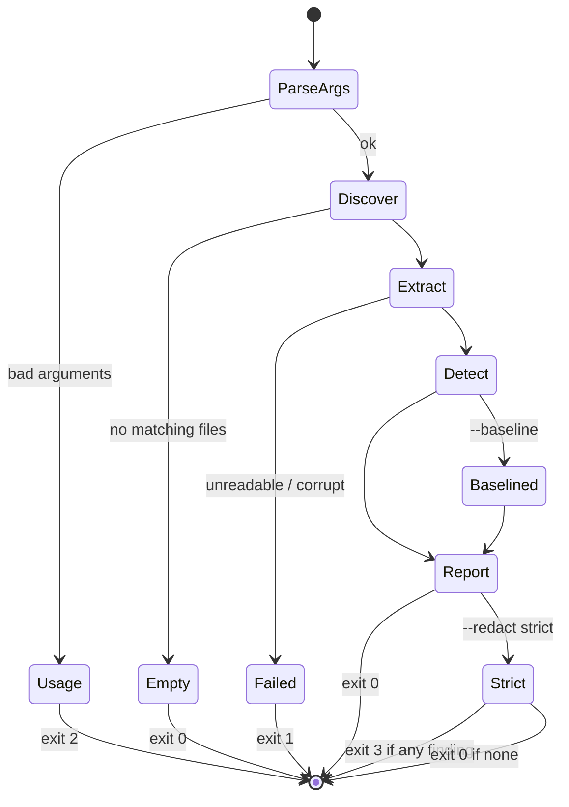

# App Flow - DocRedact

Companion to [PRD.md](PRD.md) and [TDD.md](TDD.md).

DocRedact has no screens. It has two commands, three output channels (stdout,
stderr, named files) and four exit codes, and the interesting states are the
ones a CI job hits at 3am rather than the ones a person sees. Every fragment
below is copied from a real run against the repo's own fixtures.

## How you get in

| Entry point | Used by |
| --- | --- |
| `docredact extract FILE ...` | A person, once, before sending a document |
| `docredact scan DIR ...` | A person surveying a tree, or CI gating it |
| `python -m docredact ...` | The same two, without the console script on PATH |
| A `.git/hooks/pre-commit` one-liner | The gate, before every commit |
| A CI step, usually with `--format sarif --out` | The gate, on every push |

No interactive mode, no prompt, no configuration wizard, no persistent state.
The only thing that carries between runs is the baseline file, and the user
names it explicitly every time.

## Two happy paths

**"Make this safe to send".** One document, one artifact.

1. `docredact extract report.pdf --write-redacted safe.txt --format markdown`
2. `safe.txt` is written: the document's text with every finding replaced by a
   consistent token, so the same account reads as `[IBAN_1]` in both the
   paragraph and the table that mention it.
3. A Markdown findings report goes to stdout, ending with a manifest of tokens,
   types and occurrence counts - and no values.
4. The user reads the report, then sends `safe.txt`.

**"Stop this getting worse".** A whole tree, in CI.

1. Once, at adoption: `docredact scan docs/ --redact strict --write-baseline
   .docredact-baseline.json`. Everything currently present is accepted, and the
   command exits **0 even in strict mode** - which is the point, because
   otherwise nobody would ever adopt it on a real tree.
2. On every run afterwards: `docredact scan docs/ --redact strict --baseline
   .docredact-baseline.json`. stderr reads
   `baseline: 6 finding(s) suppressed, 0 new`, exit 0.
3. Someone commits a new key. Same command, stderr reads
   `baseline: 6 finding(s) suppressed, 1 new`, exit **3**, and the output shows
   only the new finding - not the six the team already knew about.
4. They fix it, or accept it deliberately with
   `--baseline FILE --write-baseline FILE`, which refreshes the file and drops
   fixed findings out of it.

## The twelve states

This is the analogue of "every state of every screen". Every row was produced
by running the command.

| State | stdout | stderr | Exit |
| --- | --- | --- | --- |
| **Populated** (findings present) | Aligned table, then `total: 8 files, 54 entities (...)` and `severity: critical=9, high=9, ...` | - | 0 |
| **Empty tree** (`--format table`) | `no matching files` | - | 0 |
| **Empty tree** (`--format sarif`) | A complete, valid, empty SARIF run - `"results": []` | `no matching files` moves here, so the machine output stays parseable | 0 |
| **Policy applied** | unchanged | `policy: applying <path>` on every run, plus one `warning:` line per malformed element - `warning: policy has unknown key 'bogus'` | unchanged |
| **Extraction warnings** (an empty document; or content present but not read - undecodable bytes, an attachment, an embedded file, an image-only PDF page - which start `not scanned:`) | unchanged | one `warning: <path>: <message>` line per warning | unchanged, except strict mode below |
| **Strict, content not fully scanned** | the report | the `warning:` lines, then `docredact: error: scan.pdf: not fully scanned (see the 'not scanned' warnings above)` | **1** (outranks 3 and a fresh baseline) |
| **Error - an output would overwrite an input** | - | `docredact: error: refusing to overwrite an input with --write-redacted: report.txt` | 1, nothing written |
| **Baseline suppressing** | only the new findings | `baseline: 6 finding(s) suppressed, 1 new` | 0 or 3 |
| **Strict, findings present** | the report | - | **3** |
| **Error - target is not a directory** | - | `docredact: error: not a directory: fixtures/sample.txt` | 1 |
| **Error - unreadable / unsupported / corrupt file** | in `scan`, the file still gets a row: `broken.pdf  -  -  ERROR` | `docredact: error: broken.pdf: failed to parse PDF: Stream has ended unexpectedly` | **1** |
| **Usage error** | - | argparse usage block plus `docredact extract: error: the following arguments are required: file` | 2 |

Three of those rows carry reasoning a future change could undo without
noticing.

*The empty tree is explained, not blank.* `no matching files` is printed rather
than silence, and for machine formats it moves to stderr so the stdout stream
is still valid JSONL or SARIF. A CI upload step therefore works on an empty
scan instead of failing on a truncated file.

*The error state cannot be mistaken for a pass.* A file that failed to parse
exits 1, and that **outranks both a strict pass and a fresh
`--write-baseline`**. A gate that could not read a file did not check it, and
reporting 0 there would be the worst possible lie for this tool to tell. The
failed file also stays visible in the table as an `ERROR` row instead of
dropping out of the list.

*Nothing is suppressed silently.* Suppression by baseline, an applied policy, a
malformed policy line, a disabled detector, a skipped EML attachment and an
image-only PDF page each produce a line the user can see - and in strict mode
the last two fail the gate, because content it did not read is content it did
not check. The suppression count
is printed even when it is zero.

## Transitions

`--write-baseline` short-circuits the `Strict` branch to exit 0: everything
just recorded is accepted by definition. A parse failure anywhere overrides
every other outcome.

## Readable by a screen reader, a pipe and a CI log

All three get the same bytes, which is most of what accessibility means for a
program with no screen.

**No colour anywhere.** No ANSI escapes are emitted at all, so severity is
never signalled by colour - it is a word (`critical`, `high`, `medium`, `low`)
in a labelled column, and the roll-up line spells out the counts.

**Channel discipline.** Machine output on stdout, human notices on stderr.
`docredact scan dir --format jsonl | jq` works while the policy and baseline
notices still reach the terminal.

**No animation, no cursor control, no progress spinner.** Partly
accessibility, mostly determinism - a spinner is a clock, and this tool does
not read the clock.

**ASCII output**, and files written with explicit UTF-8. Column widths are
computed from the content, so nothing is truncated into ambiguity.

## Dead ends, and the one quiet failure

No dead end is reachable. Every error line names the file and the reason, so
the next action is always obvious: fix the file, exclude it with `--glob`,
rename the policy file, restore the baseline. The state that *would* be a dead
end - a corrupt file aborting the whole `scan` batch - is explicitly prevented.
The bad file gets an `ERROR` row, the rest of the tree is still scanned, and
the non-zero exit is raised at the end.

The nearest thing to a trap is quiet rather than dead. A policy file with the
wrong name is simply not discovered, and the only signal is the *absence* of
`policy: applying <path>`. That is called out in the TDD and in the MIGRATION
note, because it is the one place this tool fails without saying so.
